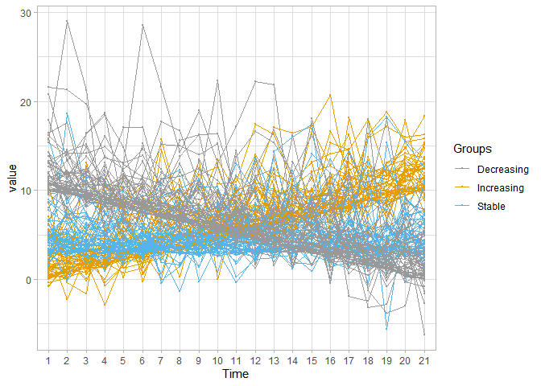

<!-- README.md is generated from README.Rmd. Please edit that file -->

# akmedoids

<!-- badges: start -->

<!-- badges: end -->

An R package for analyzing and clustering longitudinal data

### Description

The `akmedoids` package advances the clustering of longitudinal datasets
in order to identify clusters of trajectories with similar long-term
linear trends over time, providing an improved cluster identification as
compared with the classic kmeans algorithm. The package also includes a
set of functions for addressing common data issues, such as missing
entries and outliers, prior to conducting advance longitudinal data
analysis. One of the key objectives of this package is to facilitate
easy replication of a recent paper which examined small area inequality
in the crime drop (Adepeju et al. 2020). Many of the functions provided
in the `akmedoids` package may be applied to longitudinal data in
general.

**For more information and usability, check out details on
[CRAN](https://cran.r-project.org/web/packages/akmedoids/index.html).**

### Installation from `CRAN`

From an R console, type:

``` r
#install.packages("akmedoids")
library(akmedoids)

#Other libraries
library(tidyr)
library(ggplot2)
#> Warning: package 'ggplot2' was built under R version 4.0.3
library(reshape)
#> Warning: package 'reshape' was built under R version 4.0.3
library(readr)
```

To install the development version of the package, type
`remotes::install_github("MAnalytics/akmedoids")`. Please, report any
installation problems in the issues.

### Example usage:

Given a longitudinal datasets, the following is an example of how
`akmedoids` could be used to extract clusters of trajectories with
similar long-term trends over time. We will use a simulated dataset
(named `simulated.rda`) stored in the `data/` directory.

### Generating artificial dataset

Simulating data set which comprised of three clusters with distinct mean
directional change over time. Each group contains 50 trajectories.

``` r
dir.create("input") # create a folder
#> Warning in dir.create("input"): 'input' already exists

#function for creating longitudinal noise
noise_fn <- function(x=3, time){
  rnorm(length(time), mean=0, x)}

#function for simulating a trajectory group
sim_group <- function(gr_baseline, sd, time){
  intcp_errors <- rgamma(1, shape=2, scale=sd) #intercept error
  mean_traj = gr_baseline + intcp_errors
  traj = mean_traj + noise_fn(intcp_errors, time)
}

#time steps
t_steps <- c(0:20)

#increasing group
i_gr <- NULL
for(i in seq_len(50)){
  i_gr <- rbind(i_gr,
                sim_group(gr_baseline=(0.5*t_steps),
                          sd=1, time=t_steps))
}

#stable group
s_gr <- NULL
for(i in seq_len(50)){
  s_gr <- rbind(s_gr,
                sim_group(gr_baseline=rep(3,length(t_steps)),
                          sd=1, time=t_steps))
}

#decreasing group
d_gr <- NULL
for(i in seq_len(50)){
  d_gr <- rbind(d_gr,
                sim_group(gr_baseline=(10 - (0.5*t_steps)),
                          sd=1, time=t_steps))
}

#combine groups
simulated <- data.frame(rbind(i_gr, s_gr, d_gr))

#add group label
simulated <- data.frame(cbind(ID=1:nrow(simulated), simulated))

colnames(simulated) <- c("ID", 1:(ncol(simulated)-1))

#save data set
##simulated = readr::write_csv(simulated, "input/example-simulated.csv")
```

### Visualising artificial dataset

``` r

#import already save simulated data
Import_simulated = read_csv(file="./input/example-simulated.csv")

#preview the data
head(Import_simulated)
#> # A tibble: 6 x 22
#>      ID    `1`   `2`    `3`    `4`    `5`   `6`   `7`   `8`   `9`  `10`  `11`
#>   <dbl>  <dbl> <dbl>  <dbl>  <dbl>  <dbl> <dbl> <dbl> <dbl> <dbl> <dbl> <dbl>
#> 1     1 -0.759  1.90  3.02  -0.355  1.63   4.24  4.52  7.93  5.18  6.84  6.09
#> 2     2  5.52   3.22  4.49   4.61  11.2    5.90 15.7   7.76  7.46  9.76  6.61
#> 3     3  1.52   1.09  2.05   1.89   0.728  1.27  4.76  3.75  4.58  5.81  5.39
#> 4     4  3.24   2.41 -0.169  5.59   1.29   3.42  4.59  7.29  5.23  7.25  6.90
#> 5     5  0.950  2.58  2.58   1.39   3.22   3.28  3.40  6.21  5.71  3.69  7.39
#> 6     6  2.33   7.88  2.15   1.89   7.38   3.57  7.33 10.4   5.90  5.12 10.3 
#> # ... with 10 more variables: `12` <dbl>, `13` <dbl>, `14` <dbl>, `15` <dbl>,
#> #   `16` <dbl>, `17` <dbl>, `18` <dbl>, `19` <dbl>, `20` <dbl>, `21` <dbl>


#convert wide-format into long
simulated_long <- melt(t(Import_simulated), id.vars=c("ID"))

 simulated_long <- simulated_long %>%
  dplyr::filter(X1!="ID") %>%
  dplyr::rename(Time=X1, ID=X2)
# 
simulated_long <- data.frame(cbind(simulated_long,
                                   Groups= c(rep("Increasing", 50*21),
                                   rep("Stable", 50*21),
                                   rep("Decreasing", 50*21))))

#re-order levels
simulated_long$Time <- factor(simulated_long$Time, 
                                levels = c(1:21))

ggplot(simulated_long, aes(x = Time, y = value, group=ID, color=Groups)) +
  geom_point(size=0.5) + 
  geom_line() +
  scale_color_manual(values=c('#999999','#E69F00', '#56B4E9')) +
  theme_light()
```



### Performing clustering using `akmedoids`

The `akmedoids::akclustr()` is used to perform the clustering analysis.
Using the simulated data, we write:

``` r

output <- akclustr(Import_simulated, id_field=TRUE, verbose = FALSE, k=c(3,12), crit = "Silhouette",
                  quality_plot=FALSE)

#RemarkS: The results can be printed out to the console by typing `output`
```

In order to preview all the variables of the generated results, type
`names(output)`, e.g.

``` r

names(output)
#> [1] "traj"             "id_field"         "solutions"        "qualitycriterion"
#> [5] "optimal_k"        "qualityCrit.List" "qltyplot"
```

  - The output variables can be described as follow:
    
      - `traj` - returns the input data set used for the clustering.
    
      - `id_field` - indicates whether the input data set included the
        id field.
    
      - `solutions` - the list of cluster solutions by `k` values.
    
      - `qualitycriterion` - the quality criterion specified.
    
      - `optimal_k` - the optimal value of `k` as determined by the
        quality criterion.
    
      - `qualityCrit.List` - the estimated quality of cluster solutions
        by `k` values.
    
      - `qltyplot` - the plot of `qualityCrit.List`, with a red vertical
        line to indicate the optimal value of `k`.

*Accessing the optimal solution*

The plot of `qualityCrit.List` can be displayed by setting the
`quality_plot` argument as `TRUE`. Otherwise, a user may access the plot
by printing the variable `output$qltyplot` to the console. For example,

``` r

output$qltyplot
#> `geom_smooth()` using formula 'y ~ x'
```


``` r

#the intersection of the red line with the x-axis indicates the optimal k value.
```

The optimal solution is determined to be 3, as also stored by the
variable `output$optimal_k`.

### Printing Cluster Stats.

The properties (i.e. the descriptive and change statistics) of any of
the cluster solutions (i.e. for any value of `k`) can be accessed using
the special `print` function `print_akstats`. The print function takes
the `akobject` class generated by the `akmedoids::akclustr` function as
input as follows:

``` r

#Specifying the optimal solution, output$optimal_k (i.e. `k = 3`)

prpties = print_akstats(output, k = 3, show_plots = FALSE)
#> Warning: `fun.y` is deprecated. Use `fun` instead.
```

Accessing the variables of `prpties`:

``` r

names(prpties)
#> [1] "descriptive_stats" "change_stats"
```

  - output Variables described as follow:
    
      - `descriptive_stats` - descriptive statistics of the cluster.
    
      - `change_stats` - change statistics of the cluster

### Printing the group properties

*a. Descriptive Stats.*:

``` r

prpties$descriptive_stats
#>   group  n n(%) %Prop.time1 %Prop.timeT Change %Change
#> 1     A 50 33.3        63.3         9.1  -54.2  -595.6
#> 2     B 49 32.7        24.3        26.2    1.9     7.3
#> 3     C 51   34        12.4        64.7   52.3    80.8
```

*b. Change Stats.*:

``` r

prpties$change_stats
#>   group sn %+ve Traj. %-ve Traj. Qtl:1st-4th
#> 1     A  1          0        100   4th (-ve)
#> 2     B  2         49         51   1st (-ve)
#> 3     C  3        100          0   4th (+ve)
```

(See the package vignette for more details about the interpretation of
the tables)

## (iii) `plot_akstats` function:

The above printouts represent the properties (i.e. the descriptive and
change properties) of the clusters. Note that the `print_akstats`
function also include `show_plots` argument to show the plot of group
trajectories. However, the `plot_akstats` is provided to provide a more
comprehensive performance plots of the groups. Examples:

1)  ***Group trajectories (directional change over time)***

<!-- end list -->

``` r

  plot_akstats(output, k = 3, type="lines", y_scaling="fixed")
#> Warning: `fun.y` is deprecated. Use `fun` instead.
#> $cluster_plot
```


2)  ***Proportional change of groups change over time***

<!-- end list -->

``` r

  plot_akstats(output, k = 3, reference = 1, n_quant = 4, type="stacked")
#> $cluster_plot
```


### Documentation

From an R console type `??akmedoids` for help on the package. The
package page on CRAN is
[here](https://cran.r-project.org/web/packages/akmedoids/index.html),
package reference manual is
[here](https://cran.r-project.org/web/packages/akmedoids/akmedoids.pdf),
package vignette is
[here](https://cran.r-project.org/web/packages/akmedoids/vignettes/akmedoids-vignette.html).

### Support and Contributions:

For support and bug reports send an email to: <monsuur2010@yahoo.com> or
open an issue [here](https://github.com/MAnalytics/akmedoids/issues).
Code contributions to akmedoids are also very welcome.

### References:

Rousseeuw, P. J. 1987. “Silhouettes: A Graphical Aid to the
Interpretation and Validation of Cluster Analysis.” Journal of
Computational and Applied Mathematics, no. 20: 53–6.
[link](https://www.bibsonomy.org/bibtex/bc0f62c7895f91c787354d03f23da976)

Caliński, T., and J. Harabasz. 1974. “A Dendrite Method for Cluster
Analysis.” Communications in Statistics-Theory and Methods, 3(1): 1–27.
[link](https://www.tandfonline.com/doi/abs/10.1080/03610927408827101)

Adepeju, M., Langton, S. and Bannister, J. 2020. Anchored k-medoids: a
novel adaptation of k-means further refined to measure instability in
the exposure to crime. Journal of Computational Social Science
(Revised).
