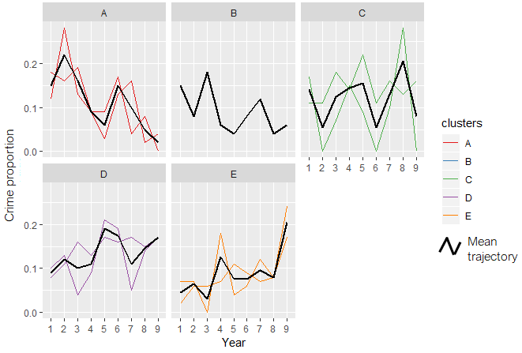

<style type="text/css">

h1.title {
  font-size: 26px;
  line-height: 130%;
  color: Black;
  text-align: center;
}

h2.subtitle {
  font-size: 13px;
  line-height: 120%;
  color: Black;
  text-align: center;
}

h4.author { /* Header 4 - and the author and data headers use this too  */
  font-size: 17px;
  font-family: "Arial";
  color: Black;
  text-align: center;
}
h4.date { /* Header 4 - and the author and data headers use this too  */
  font-size: 17px;
  font-family: "Arial", Times, serif;
  color: Black;
  text-align: center;
}

h4.abstract { /* Header 4 - and the author and data headers use this too  */
  font-size: 10px;
  font-family: "Arial", Times, serif;
  color: black;
  text-align: center;
}

h4.institute{ /* Header 4 - and the author and data headers use this too  */
  font-size: 10px;
  font-family: "Arial", Times, serif;
  color: black;
  text-align: center;
}

body, td {
   font-size: 14px;
}
code.r{
  font-size: 13px;
}
pre {
  font-size: 13px
}
h1 { /* Header 1 */
  font-size: 16px;
  color: DarkBlue;
}
h2 { /* Header 2 */
    font-size: 16px;
  color: DarkBlue;
}
h3 { /* Header 3 */
  font-size: 15px;
  font-family: "Times New Roman", Times, serif;
  color: DarkBlue;

</style>

```{r setup, include = FALSE}
knitr::opts_chunk$set(
  collapse = TRUE,
  comment = "#>"
)
```

```{r functions, include=FALSE}
# A function for captioning and referencing images
fig <- local({
    i <- 0
    ref <- list()
    list(
        cap=function(refName, text) {
            i <<- i + 1
            ref[[refName]] <<- i
            paste("Figure ", i, ": ", text, sep="")
        },
        ref=function(refName) {
            ref[[refName]]
        })
})
```

# Introduction

Longitudinal clustering analysis is ubiquitous in social and behavioural sciences for investigating the developmental processes of a phenomenon over time. Examples of the commonly used techniques in these areas include group-based trajectory modelling (GBTM) and the non-parametric kmeans method. Whilst kmeans has a number of benefits over GBTM, such as more relaxed statistical assumptions, generic implementations render it more sensitive to outliers and short-term fluctuations, which minimises its ability to identify long-term linear trends in data. In crime and place research, for example, the identification of such `long-term` linear trends may help to develop some theoretical understanding of criminal victimisation within a geographical space [@Weisburd2004; @Griffith2004]. In order to address this sensitivity problem, we advance a novel technique named `anchored kmedoids` (`'akmedoids'`) which implements three key modifications to the existing longitudinal `kmeans` approach. First, it approximates trajectories using ordinary least square regression (`OLS`) and second, `anchors` the initialisation process with median observations. It then deploys the `medoids` observations as new anchors for each iteration of the expectation-maximisation procedure [@Celeux1992]. These modifications ensure that the impacts of short-term fluctuations and outliers are minimised. By linking the final groupings back to the original trajectories, a clearer delineation of the long-term linear trends of trajectories are obtained.

We facilitate the easy use of `akmedoids` through an open-source package using `R`. We encourage the use of the package outside of criminology, should it be appropriate. Before outlining the main `clustering` functions, we demonstrate the use of a few `data manipulation` functions that assist in data preparation. The worked demonstration uses a small example dataset which should allow users to get a clear understanding of the operation of each function. 

```{r, echo=FALSE, include=FALSE}
require(knitr)
library(flextable)
library(kableExtra)
library(clusterCrit)
```

```{r, echo=FALSE, include=FALSE}

col1 <- c("1", "2","3","4", "5")
col2 <- c("`dataImputation`","`rates`", "`props`", "`outlierDetect`","`wSpaces`")
col3 <- c("Data imputation for longitudinal data", "Conversion of 'counts' to 'rates'", "Conversion of 'counts' (or 'rates') to 'Proportion'", "Outlier detection and replacement","Whitespace removal")
col4 <- c("Calculates any missing entries (`NA`, `Inf`, `null`) in a longitudinal data, according to a specified method","Calculates rates from observed 'counts' and its associated denominator data", "Converts 'counts' or 'rates' observation to 'proportion'", "Identifies outlier observations in the data, and replace or remove them","Removes all the leading and trailing whitespaces in a longitudinal data")
tble <- data.frame(col1, col2, col3, col4)
tble <- tble
```

```{r table1, results='asis', echo=FALSE, tidy.opts=list(width.cutoff=50)}
knitr::kable(tble, caption = "Table 1. `Data manipulation` functions", col.names = c("SN","Function","Title","Description")) %>%
  kable_styling(full_width = F) %>%
  column_spec(1, bold = T, border_right = T) %>%
  column_spec(2, width = "8em", background = "white") %>%
  column_spec(3, width = "12em", background = "white") %>%
  column_spec(4, width = "16em", background = "white")#%>%
  #row_spec(3:5, bold = T, color = "white", background = "#D7261E")
```

#1. Data manipulation

Table 1 shows the main data manipulation functions and their descriptions. These functions help to address common data issues prior to analysis, as well as basic data manipulation tasks such as converting longitudinal data from `count` to `proportion` measures (as per the crime inequality paper where `akmedoids` was first implemented). In order to demonstrate the utility of these functions, we provide a simulated dataset `traj` which can be called by typing `traj` in `R` console after loading the `akmedoids` library.


### (i) `"dataImputation"` function

Calculates any missing entries in a data, according to a chosen method. This function recognises three kinds of data entries as missing. These are `NA`, `Inf`, `null`, and an option of whether or not to consider `0`'s as missing values. The function provides a replacement option for the missing entries using two methods. First, an `arithmetic` method which uses the `mean`, `minimum` or `maximum` value of the corresponding rows or columns of the missing values. Second, a `regression` method which uses OLS  regression lines to estimate the missing values. Using the regression method, only the missing data points derive values from the regression line while the remaining (observed) data points retain their original values. The function terminates if there is any trajectory with only one observation in it. Using the `'traj'` dataset, we demonstrate how the `'regression'` method estimates missing values. 


```{r, eval=FALSE}

#installing the `akmedoids` packages
install.packages("devtools")
devtools::install_github("manalytics/packages/akmedoids")

```

```{r, eval=TRUE}

#loading the package
library(akmedoids)

```

```{r, eval=TRUE}

#viewing the first 6 rows of 'traj' object
head(traj)

#no. of rows
nrow(traj) 

#no. of columns
ncol(traj) 

```

The first column of the `traj` object is the `id` (unique) field. In many applications, it is necessary to preserve the `id` column in order to allow linking of outputs to other external datasets, such as spatial location data. Most of the functions of the `akmedoids` provides an option to recognise the first column of an input dataset as the unique field. The `dataImputation` function can be used to imput the missing data point of `traj` object as follows:


```{r, eval=TRUE}
imp_traj <- dataImputation(traj, id_field = TRUE, method = 2, 
               replace_with = 1, fill_zeros = FALSE)

#viewing the first 6 rows
head(imp_traj)
```

```{r figs1, echo=FALSE, fig.width=5,fig.height=6,fig.align="center", fig.cap=fig$cap("figs1", "Data imputation with regression")}

par(mar=c(2,2,2,2)+0.1)
par(adj = 0)
par(mfrow=c(6,2))
dat <- as.data.frame(traj)
t_name <- as.vector(traj[,1])
dat <- dat[,2:ncol(dat)]
#if(k==nrow(dat)){
  #}
#head(dat)
for(k in 1:nrow(dat)){ #k<-2
  y <- suppressWarnings(as.numeric(as.character(dat[k,])))
  x <- 1:length(y)
  known <- data.frame(x, y)
  known_1 <- data.frame(known[is.na(known[,2])|is.infinite(known[,2]),])  #
  known_2 <- data.frame(known[!is.na(known[,2])&!is.infinite(known[,2]),])
  #train the available data using linear regression
  model.lm <- lm(y ~ x, data = known_2)
  # Use predict the y value for the removed data
  newY <- predict(model.lm, newdata = data.frame(x = known_1[,1]))
   l_pred <- predict(model.lm, newdata = data.frame(1:9)) #line
  #add to the original data.
  dat[k, known_1[,1]] <- newY
  #Add the predicted points to the original data
  #dev.new()
  #plot(1:10, col=2)
  plot (known$x, known$y, type="o", main=paste("traj_id:",t_name[k], sep=" "), font.main = 1)
  if(!length(newY)==0){#plot only if it has elements
  lines(l_pred, lty="dotted", col="red", lwd=2)
  }
  points(known_1[,1], newY, col = "red")
}
#point legend
plot_colors <- c("black","red")
text <- c("Observed points", "Predicted points")
plot.new()
par(xpd=TRUE)
legend("center",legend = text, text.width = max(sapply(text, strwidth)),
       col=plot_colors, pch = 1, cex=1, horiz = FALSE)
par(xpd=FALSE)

#line legend
plot_colors <- c("black","red")
text <- c("line joining observed points", "regression line predicting missing points")
plot.new()
par(xpd=TRUE)
legend("center",legend = text, text.width = max(sapply(text, strwidth)),
       col=plot_colors, lwd=1, cex=1, lty=c(1,2), horiz = FALSE)
par(xpd=FALSE)
```


The argument `method = 2` refers to the `regression` technique, while the argument `replace_with = 1` refers to the `linear` option (currently the only available option). Figure `r fig$ref("figs1")` is a graphical illustration of how this method approximates the missing values of the `traj` object.

### Estimating the population data using the `'dataImputation'` function

Obtaining the denominator information (e.g. population estimates to normalise counts) of local areas within a city for non-census years is problematic in longitudinal studies. This challenge poses a significant drawback to the accurate estimation of various measures, such as crime rates and population-at-risk of an infectious disease. Assuming a limited amount of denominator information is available, an alternative way of obtaining the missing data points is to interpolate and/or extrapolate the missing population information using the available data points. The `dataImputation` function can be used to perform this task. 

The key step towards using the function for this purpose is to create a matrix, containing both the available fields and the missing fields arranged in their appropriate order. All the entries of the missing fields can be filled with either `NA` or `null`. Below is a demonstration of this task with a sample population dataset with only two available data fields. The corresponding `input` matrix is constructed as shown.

```{r, eval=TRUE}

#viewing the data first 6 rows
head(population)

nrow(population) #no. of rows

ncol(population) #no. of columns
```


The corresponding `input` dataset is prepared as follows and saved as `population2`:


```{r, echo=FALSE}
#create a matrix of the same rows and column as the `traj` data
pop <- as.data.frame(matrix(0, nrow(population), ncol(traj)))
colnames(pop) <- names(traj) 
pop[,1] <- as.vector(as.character(population[,1]))
pop[,4] <- as.vector(as.character(population[,2]))
pop[,8] <- as.vector(as.character(population[,3]))
list_ <- c(2, 3, 5, 6, 7, 9, 10)
for(u_ in 1:length(list_)){ #u_<-1
  pop[,list_[u_]] <- "NA"
}

head(pop)

population2 <- pop
```


The missing values are estimated as follows using the `regression` method of the `dataImputation` function: 


```{r, eval=TRUE}

pop_imp_result <- dataImputation(population2, id_field = TRUE, method = 2, 
               replace_with = 1, fill_zeros = FALSE)

#viewing the first 6 rows
head(pop_imp_result)

```


Given that there are only two data points in each row, the `regression` method will simply generate the missing values by fitting a straight line to the available data points. The higher the number of available data points in any trajectory the better the estimation of the missing points. Figure `r fig$ref("figs1")` illustrates this estimation process. 


###(ii) `"rates"` function

Given a longitudinal data ($m\times n$) and its associated denominator data ($s\times n$), the `'rates'` function converts the longitudinal data to 'rates' measures (e.g. counts per 100 residents). Both the longitudinal and the denominator data may contain different number of rows, but need to have the same number of columns, and must include the `id` (unique) field as their first column. The rows do not have to be sorted in any particular order. The rate measures (i.e. the output) will contain only rows whose `id's` match from both datasets. We demonstrate the utility of this function using the `imp_traj` object (above) and the estimated population data ('`pop_imp_result`'). 


```{r, eval=TRUE}

#example of estimation of 'crimes per 200 residents'
crime_per_200_people <- rates(imp_traj, denomin=pop_imp_result, id_field=TRUE, 
                              multiplier = 200)

#view the full output
crime_per_200_people

#check the number of rows
nrow(crime_per_200_people)

```

From the output, it can be observed that the number of rows of the output data is 9. This implies that only 9 `location_ids` match between the two datasets. The unmatched `ids` are ignored. **Note**: the calculation of `rates` often returns outputs with some of the cell entries having `Inf` and `NA` values, due to calculation errors and character values in the data. We therefore recommend that users re-run the `dataImputation` function after generating `rates` measures, especially for a large data matrix.


###(iii) `"props"` function {#props}


Given a longitudinal data, the `props` function converts each data point (i.e. entry in each cell) to the proportion of the sum of their corresponding column. Using the `crime_per_200_people` estimated above, we can derive the `proportion of crime per 200 people` for each entry as follows:  


```{r, eval=TRUE}

#Proportions of crimes per 200 residents
prop_crime_per200_people <- props(crime_per_200_people, id_field = TRUE, scale = 1, digits=2)

#view the full output
prop_crime_per200_people


#A quick check that sum of each column of proportion measures adds up to 1.  
colSums(prop_crime_per200_people[,2:ncol(prop_crime_per200_people)])


```

In line with the demonstration in Adepeju et al. (2019), we will use these `proportion` measures to demonstrate the main clustering function of this package. 


### (iv) `"outlierDetect"` function
This function is aimed at allowing users to identify any outlier observations in their longitudinal data, and replace or remove them accordingly. The first step towards identifying outliers in any data is to visualise the data. A user can then decide a cut-off value for isolating the outliers. The `outlierDetect` function provides two options for doing this: (`i`) a `quantile` method, which isolates any observations with values higher than a specified quantile of the data values distribution, and (`ii`) a `manual` method, in which a user specifies the cut-off value. The '`replace_with`' argument is used to determine whether an outlier value should be replaced with the mean value of the row or the mean value of the column in which the outlier is located. The user also has the option to simply remove the trajectory that contains an outlier value. In deciding whether a trajectory contains outlier or not, the `count` argument allows the user to set an horizontal threshold (i.e. number of outlier values that must occur in a trajectory) in order for the trajectory to be considered as having outlier observations. Below, we demonstrate the utility of the `outlierDetect` function using the `imp_traj` data above. 


```{r figs2, echo=TRUE, fig.width=6,fig.height=3,fig.align="center", fig.cap=fig$cap("figs2", "Identifying outliers")}

#Plotting the data using ggplot library
library(ggplot2)
library(reshape2)

#converting the wide data format into stacked format for plotting
imp_traj_long <- melt(imp_traj, id="location_ids") 

#view the first 6 rows
head(imp_traj_long)

#plot function
p <-  ggplot(imp_traj_long, aes(x=variable, y=value,
            group=location_ids, color=location_ids)) + 
            geom_point() + 
            geom_line()

print(p)

```

Figure `r fig$ref("figs2")`  is the output of the above plot function.  

Based on Figure `r fig$ref("figs2")` if we assume that observations of `x2001`, `x2007` and `x2008` of trajectory id `E01004806` are outliers, we can set the `threshold` argument as `20`. In this case, setting `count=1` will suffice as the trajectory is clearly separable from the rest of the trajectories.  


```{r figs3, echo=TRUE, fig.width=6,fig.height=3,fig.align="center", fig.cap=fig$cap("figs3", "Replacing outliers with mean observation")}

imp_traj_New <- outlierDetect(imp_traj, id_field = TRUE, method = 2, 
                              threshold = 20, count = 1, replace_with = 2)

imp_traj_New_long <- melt(imp_traj_New, id="location_ids") 

#plot function
p <-  ggplot(imp_traj_New_long, aes(x=variable, y=value,
            group=location_ids, color=location_ids)) + 
            geom_point() + 
            geom_line()

print(p)

```

Setting `replace_with = 2`, that is to replace the outlier points with the 'mean of the row observations', the function generates outputs re-plotted in Figure `r fig$ref("figs3")`.

###(v) 'Other' functions

Please see the `akmedoids` user manual for the remaining `data manipulation` functions. 


#2. Data Clustering

Table 2 shows the two main functions required to carry out the longitudinal clustering and generate the descriptive statistics of the resulting groups. The relevant functions are `akmedoids.clust` and `statPrint`. The `akmedoids.clust` function clusters trajectories according to the similarities of their long-term trends, while the `statPrint` function extracts descriptive and change statistics for each of the clusters. The latter also generates `quality` plots for the best cluster solution.

The long-term trends of trajectories are defined in terms of a set of OLS regression lines. This allows the clustering function to classify the final groupings in terms of their slopes as `rising`, `stable`, and `falling`. The key benefits of this implementation is that it allows the clustering process to ignore the short-term fluctuations of actual trajectories and focus on their long-term linear trends. Adepeju and colleagues (2019) applied this technique in crime concentration research for measuring long-term inequalities in the exposure to crime at find-grained spatial scales. 

```{r figs4, echo=FALSE, fig.cap=fig$cap("figs4", paste("Long-time linear trends of relative (`proportion`, `p`) crime exposure. Three inequality trends: trajectory i1: crime exposure is falling faster, i2, crime exposure is falling at the same rate, and i3, crime exposure is falling slower or increasing, relatively to the citywide trend. (Source:", "Adepeju et al. 2019)", sep=" ")), out.width = '60%', fig.align="center"} 
knitr::include_graphics("inequality.png")
```

Their implementation was informed by the conceptual (`inequality`) framework shown in Figure `r fig$ref("figs4")`. That said, `akmedoids` can be deployed on any measure (counts, rates) and is not limited to criminology, but rather, any field where the aim is to cluster longitudinal data based on long-term trajectories. By mapping the resulting trend lines grouping to the original trajectories, various performance statistics can be generated. 

In addition to the use of trend lines, the `akmedoids` makes two other modifications to the expectation-maximisation clustering routines [@Celeux1992]. First, the `akmedoids` implements an anchored median-based initialisation strategy for the clustering to begin. The purpose behind this step is to give the algorithm a theoretically-driven starting point and try and ensure that heterogenous trend slopes end up in different clusters (@Khan2004; @Steinley2007). Second, instead of recomputing centroids based on the mean distances between each trajectory trend lines and the cluster centers, the median of each cluster is selected and then used as the next centroid. This then becomes the new anchor for the current iteration of the expectation-maximisation step [@Celeux1992]. This strategy is implemented in order to minimise the impact of outliers. The iteration then continues until an objective function is maximised.  


```{r, echo=FALSE, include=FALSE}

col1 <- c("1", "2")
col2 <- c("`akmedoids.clust`","`statPrint`")
col3 <- c("`Anchored k-medoids clustering`","`Descriptive (Change) statistics and plots`")
col4 <- c("Clusters trajectories into a `k` number of groups according to the similarities in their long-term trend and determines the best solution based on the Calinski-Harabatz criterion","Generates the descriptive and change statistics of groups, and also plots the groups performances")
tble2 <- data.frame(col1, col2, col3, col4)
tble2 <- tble2

```

```{r table2, results='asis', echo=FALSE, tidy.opts=list(width.cutoff=50)}
knitr::kable(tble2, caption = "Table 2. `Data clustering` functions", col.names = c("SN","Function","Title","Description")) %>%
  kable_styling(full_width = F) %>%
  column_spec(1, bold = T, border_right = T) %>%
  column_spec(2, width = "8em", background = "white") %>%
  column_spec(3, width = "12em", background = "white") %>%
  column_spec(4, width = "16em", background = "white")#%>%
  #row_spec(3:5, bold = T, color = "white", background = "#D7261E")

```


```{r figs5, echo=TRUE, fig.width=6,fig.height=3,fig.align="center", fig.cap=fig$cap("figs5",  "Trajectory of crime proportions over time")}

#Visualising the proportion data

#view the first few rows
head(prop_crime_per200_people)

prop_crime_per200_people_melt <- melt(prop_crime_per200_people, id="location_ids") 

#plot function
p <-  ggplot(prop_crime_per200_people_melt, aes(x=variable, y=value,
            group=location_ids, color=location_ids)) + 
            geom_point() + 
            geom_line()

print(p)

```

In the following sections, we provide a worked example of clustering with `akmedoids.clust` function using the `prop_crime_per200_people` object. The `statPrint` function will then generate the descriptive summary of the clusters. The `prop_crime_per200_people` object is plotted in `r fig$ref("figs5")` as follows: 


### (i) `akmedoids.clust` function

***Dataset***: 

Each trajectory in Figure `r fig$ref("figs5")` represents the proportion of crimes per 200 residents in each location over time. The goal is to first extract the inequality trend lines such as in Figure `r fig$ref("figs4")` and then cluster them according to the similarity of their slopes. For the `akmedoids.clust` function, a user sets the `k` value which may be an integer or a vector of length two specifying the minimum and maximum numbers of clusters to loop through. In the latter case, the `akmedoids.clust` function employs either the `Silhouette` (@Rousseeuw1987)) or the `Calinski_Harabasz` score (@Calinski1974;  @Genolini2010) to determine the best cluster solution. The function is executed as follows:

```{r, echo=TRUE, include=TRUE}

#clustering
quality_plot <- akmedoids.clust(prop_crime_per200_people, id_field = TRUE, 
                                  method = "linear", k = c(3,8), crit = "Calinski_Harabasz")

#generate performance (quality) plot
quality_plot

```

```{r figs6, echo=FALSE, fig.cap=fig$cap("figs6", "Clustering performance at different values of k"), out.width = '80%', fig.align="center"} 
knitr::include_graphics("caliHara.png")
```


In addition to the performance plot (Figure `r fig$ref("figs6")`) that shows the `Calinki-Harabatz` scores at different values of `k`, the `akmedoids.clust` function also generates output messages which include the group memberships of the best solution, as determined quality criterion used. From the plot, the best value of `k` is the highest at `k=5`, and therefore determined as the best solution. It is recommended that the determination based on either of the quality criteria should be used complementarity with users judgement in relation to the problem at hand. 

Given a value of `k`, the group membership (labels) of its cluster solution can be extracted by typing the following command: 

```{r, echo=TRUE, include=TRUE}

#clustering
cluster_output <- akmedoids.clust(prop_crime_per200_people, id_field = TRUE, 
                                  method = "linear", k = c(5))

#vector of group memberships
as.vector(cluster_output$memberships) 

```


Also, note that the indexes of the group memberships correspond to that of the trajectory object (`prop_crime_per200_people`) inputted into the function. That is, the membership labels, `"C"`, `"D"`, `"E"`, `....` are the group membership of the trajectories `"E01012628"`,`"E01004768"`,`"E01004803"`,`...` of the object `prop_crime_per200_people`.

### (ii) `statPrint` function:

Given the vector of group membership (labels), such as  `= c("C", "D", "E", "B",....)` in the example above, and its corresponding trajectory object,  `prop_crime_per200_people`, the `statPrint` function generates both the `descriptive` and the `change` statistics of the groups. The function also generates the plots of the `group memberships` and their `performances` in terms of their shares of the `proportion` measure captured over time. 

In trajectory clustering analysis, the resulting groups are often re-classified into larger classes based on the slopes, such as `Decreasing`, `Stable`, or `Increasing` classes (@Weisburd2004;Andresen et al. 2017). The slope of a group is the angle made by the medoid of the group relative to a reference line ($R$). The `reference` argument is specified as `1`, `2` or `3`, representing the `mean trajectory`, `medoid trajectory`, or a `horizontal line with slope = 0`, respectively. Let $\vartheta_{1}$ and $\vartheta_{n}$ represent the angular deviations of the group medoids with the lowest slope (negative) and highest (positive) slopes, respectively. 

```{r figs7, echo=FALSE, fig.cap=fig$cap("figs7", "Quantile sub-divisions of most-diverging groups (N.quant=4)"), out.width = '80%', fig.align="center"} 

knitr::include_graphics("Nquant.png")

```

If we sub-divide each of these slopes into a specified number of equal intervals (quantiles), the specific interval within which each group medoid falls can be determined. This specification is made using the `N.quant` argument. Figure `r fig$ref("figs7")` illustrates the quantiles sub-divisions for `N.quant = 4`.

In addition to the slope composition of trajectories found in each group, the quantile location of each group medoid can be used to further categorise the groups into larger classes. We refer users to the package `user manual` for more details about these parameters. Using the current example, the function can be ran as follows: 


```{r, echo=TRUE, include=TRUE}

#assigning k=5 cluster membership to a variable
clustr <- as.vector(cluster_output$memberships) 

#plotting the group membership
print(statPrint(clustr, prop_crime_per200_people, id_field=TRUE, reference = 1, N.quant = 4, type="lines", y.scaling="fixed"))

```

```{r, echo=TRUE, include=TRUE}

#assigning k=5 cluster membership to a variable
clustr <- as.vector(cluster_output$memberships) 

#plotting the group membership
print(statPrint(clustr, prop_crime_per200_people, id_field=TRUE, reference = 1, N.quant = 4, type="stacked"))

```

```{r figs8, echo=FALSE, fig.cap=fig$cap("figs8","group memberships"), out.width = '85%', fig.align="center"} 



```

The above printouts are generated along with the plot of group memberships as shown in Figure `r fig$ref("figs8")` (see Table 3 for the description of the output table fields). 

In the context of the long-term inequality study, broad conclusions can be made from these outputs regarding relative crime exposure in the area represented by each group or class (Adepeju et al. 2019). For example, whilst relative crime exposure have declined in 33.3% (groups `A` and `B`) of the study area, the relative crime exposure have risen in 44.4% (groups `D` and `E`) of the area. The relative crime exposure can be said to be `stable` in 22.2% (group `C`) of the area, based on its close proximity to the reference line. The medoid of the group falls within the $1^{st}(+ve)$ quantile (see Figure `r fig$ref("figs8")`). In essence, we determine that groups `A` and `B` belong to the `Decreasing` class, while groups `D` and `E` belong to the `Increasing` class. 

It is important to state that this proposed classification method is  simply advisory; you may devise a different approach or interpretation depending on your research questions and data.


```{r figs9, echo=FALSE, fig.cap=fig$cap("figs9", "group quality over time"), out.width = '60%', fig.align="center"} 

knitr::include_graphics("traj_perfm2.png")

```

By changing the argument `type="line"` to `type="stacked"`, a `quality plot` is generated instead (see Figure `r fig$ref("figs9")`). Note that these plots make use of functions within the `ggplot2` library [@Wickham2016]. For a more customised visualisation, we recommend that users deploy the `ggplot2` library directly. 


```{r, echo=FALSE, include=FALSE}

col1 <- c("1", "2","3","4","5","6", "7","8","9","10")
col2 <- c("`group`", "`n`", "`n(%)`", "`%Prop.time1`", "`%Prop.timeT`", "`Change`", "`%Change`", "`%+ve Traj.`", "`%-ve Traj.`", "`Qtl:1st-4th`")
col3 <- c("`group membershp`", "`size (no.of.trajectories.)`", "`% size`", "`% proportion of obs. at time 1 (2001)`", "`proportion of obs. at time T (2009)`", "`absolute change in proportion between time1 and timeT`", "`% change in proportion between time 1 and time T`", "`% of trajectories with positive slopes`", "`% of trajectories with negative slopes`", "`Position of a group medoid in the quantile subdivisions`")
tble3 <- data.frame(col1, col2, col3)
tble3 <- tble3

```

```{r table3, results='asis', echo=FALSE, tidy.opts=list(width.cutoff=50)}

knitr::kable(tble3, caption = "Table 3. field description of clustering outputs", col.names = c("SN","field","Description")) %>%
  kable_styling(full_width = F) %>%
  column_spec(1, bold = T, border_right = T) %>%
  column_spec(2, width = "8em", background = "white") %>%
  column_spec(3, width = "12em", background = "white") #%>%
  #row_spec(3:5, bold = T, color = "white", background = "#D7261E")

```


#Conclusion

The `akmedoids` package has been developed in order to aid the replication of a place-based crime inequality investigation conducted in Adepeju et al. (2019). Meanwhile, the utility of the functions in this package are not limited to criminology, but rather can be applicable to longitudinal datasets more generally. This package is being updated on a regular basis to add more functionalities to the existing `functions` and add new functions to carry out other longitudinal data analysis. 

We encourage users to report any bugs encountered while using the package so that they can be fixed immediately. Welcome contributions to this package which will be acknowledged accordingly. 

#References
